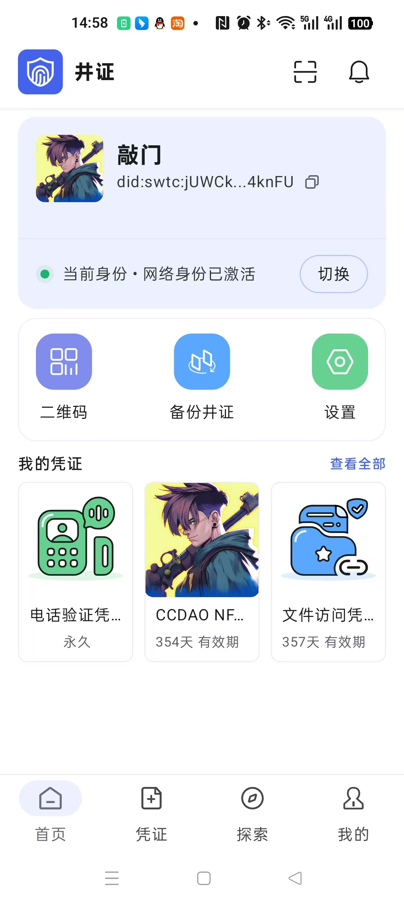
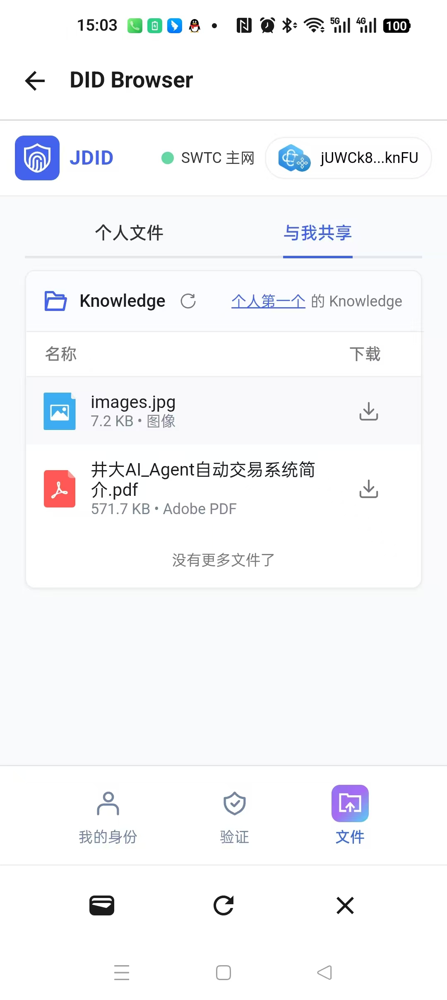
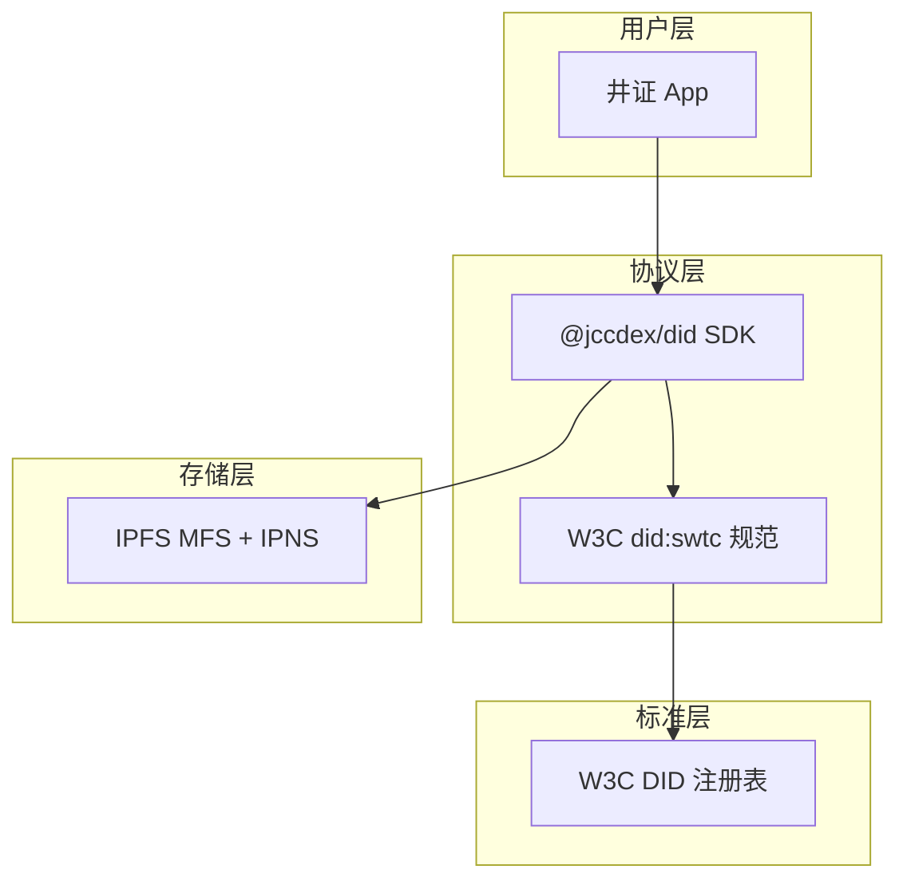

# 从提案到注册：井通链 `did:swtc` 正式写入 W3C DID 方法注册表

## 开篇：你的链上地址，也可以是全球通用的数字身份

你有没有想过，钱包地址能不能不只是"收钱的字符串"，而是真正成为**可验证、可解析、可互操作**的数字身份？

W3C 的 DID（Decentralized Identifier，去中心化标识符）标准，就是为此而生。它让"我是谁"这件事，不再绑定在某个平台的账号体系里，而是变成一条开放协议——任何符合规范的系统都能读取、验证、对接。

2025 年 10 月，**上海光元科技**与**安徽井畅**共同向 W3C DID 方法注册表提交了 `did:swtc` 方法申请；经过多轮审查与修订，**2026 年 7 月 6 日，[PR #648](https://github.com/w3c/did-extensions/pull/648) 正式合并**。这意味着井通链（SWTC Chain）的 DID 方法，已被纳入 W3C 官方 DID 扩展注册表，与全球其他 DID 方法并列。

`did:swtc` 标准是两家公司**共同推进、不分主次**的协作成果。本文带你走完这条"从提案到注册"的路，介绍背后的技术方案与开发工具，以及上海光元基于该标准打造的终端应用——**井证 App**（目前正申请上架中）。

---

## 一、DID 是什么？为什么值得做标准注册？


### 用人话说：一套"全球通用的身份 URL"

传统互联网身份：

```javascript
const traditionalIdentity = {
    微信身份: "绑定腾讯账号体系",
    支付宝身份: "绑定蚂蚁账号体系",
    问题: "平台之间互不相认，数据被平台锁定"
};
```

DID 身份：

```javascript
const didIdentity = {
    标识符: "did:swtc:j35Zw6UFMpxiNv5j4JyEnzJ6e18C1eex5h",
    特点: [
        "用户自主控制",
        "不依赖单一平台",
        "可携带可验证凭证（VC）",
        "全球互操作"
    ]
};
```

一个 DID 由三部分组成：**方法名**（如 `swtc`）+ **方法特定标识符**（如 SWTC 地址）+ 可选的路径/片段。任何人都可以通过标准解析流程，获取对应的 DID Document（DID 文档），从中读取公钥、服务端点、可验证凭证等信息。

### 为什么要注册到 W3C？

W3C DID 方法注册表（[did-extensions](https://github.com/w3c/did-extensions)）是去中心化身份生态的"电话簿"。注册的意义在于：


| 价值       | 说明                                                             |
| -------- | -------------------------------------------------------------- |
| **互操作性** | 其他 DID 解析器、钱包、凭证验证系统可以识别 `did:swtc:` 前缀                        |
| **规范背书** | 方法规范经过 W3C 社区审查，满足语法、CRUD、安全与隐私等最低要求                           |
| **生态接入** | 便于与 SSI（Self-Sovereign Identity）、VC（Verifiable Credential）生态对接 |
| **长期可信** | 注册条目持久公开，方法规范链接固定可查                                            |


---


## 二、注册之路：8 个月，三轮审查


### 时间线一览


| 时间             | 事件                                                                                  |
| -------------- | ----------------------------------------------------------------------------------- |
| 2025-10-29     | 提交 [PR #648](https://github.com/w3c/did-extensions/pull/648)，新增 `methods/swtc.json` |
| 2025-10-29     | 注册表编辑 ottomorac 首轮反馈：需补充方法结构、CRUD 说明、安全与隐私章节                                        |
| 2025-10-30     | 团队修订规范文档并推送更新                                                                       |
| 2025-11-05     | ottomorac 批准，认为满足最低标准                                                               |
| 2025-11-07     | 社区成员 swcurran 提出补充建议（用例说明、地址转换、IPNS 更新机制等）                                          |
| 2026-03-17     | 团队逐一回复技术问题                                                                          |
| 2026-07-03     | swcurran 批准                                                                         |
| 2026-07-05     | GitHub Actions 自动规范审查通过（✅ PASS）                                                     |
| **2026-07-06** | **PR 合并，**`did:swtc` **正式注册**                                                       |


### 审查过程中我们完善了哪些内容？

W3C 注册表编辑的核心要求可以概括为三件事：

**1. 方法特定标识符（Method Specific Identifier）**

必须清晰说明 `did:swtc:` 后面跟的是什么。我们的答案是：**经 Base58 编码的 SWTC 链地址**，由 secp256k1 公钥通过 `deriveAddress` 函数派生，33 或 34 字符，永久且唯一。

```text
did:swtc:j35Zw6UFMpxiNv5j4JyEnzJ6e18C1eex5h
         └────────── SWTC 地址 ──────────┘
```

**2. CRUD 操作（创建、读取、更新、停用）**


| 操作                | did:swtc 实现方式                                       |
| ----------------- | --------------------------------------------------- |
| **Create**        | 离线生成 secp256k1 密钥对 → 派生 SWTC 地址 → 地址即 DID，无需链上注册    |
| **Read（Resolve）** | 向 IPFS 服务以 DID 为键查询 DID Document                    |
| **Update**        | 上传新版 DID Document 到 IPFS MFS，通过 IPNS 发布根目录确保解析到最新版本 |
| **Deactivate**    | 不支持 DELETE；可通过写入空载荷覆盖实现"删除"效果                       |


**3. 安全与隐私考量**

规范中专门论述了密钥控制、DID 文档公开性、敏感个人信息（PII）保护等议题——DID Document 一旦被锚定，任何人都可以解析，因此不应在其中存放真实世界的隐私数据。

### 注册条目

合并后，W3C 注册表中的条目如下：

```json
{
  "name": "swtc",
  "status": "registered",
  "verifiableDataRegistry": "IPFS",
  "contactName": "JDID",
  "contactEmail": "jccdex@jccdex.com",
  "contactWebsite": "https://jdid.cn",
  "specification": "https://github.com/JCCDex/SWTC-DID/blob/main/docs/did-method-spec-en.md"
}
```

完整规范文档：

- 英文版：[did-method-spec-en.md](https://github.com/JCCDex/SWTC-DID/blob/main/docs/did-method-spec-en.md)
- 中文版：[did-method-spec-zh.md](https://github.com/JCCDex/SWTC-DID/blob/main/docs/did-method-spec-zh.md)

---


## 三、技术架构：`did:swtc` 是怎么工作的？


### 核心设计：地址即身份，IPFS 承载文档

```javascript
const didSwtcArchitecture = {
    身份层: "SWTC 地址（secp256k1 → Base58）= DID 标识符",
    存储层: "IPFS MFS（Mutable File System）存储 DID Document",
    发现层: "IPNS 发布根目录，确保更新后可解析到最新文档",
    凭证层: "DID Document 内嵌 VC（Verifiable Credential）",
    特点: "创建可离线，锚定可选，密钥可轮换"
};
```

整体流程可以用下面这张图理解：


### DID Document 长什么样？

一个典型的 `did:swtc` 文档结构：

```json
{
  "@context": [
    "https://www.w3.org/ns/did/v1",
    "https://www.w3.org/2018/credentials/v1",
    { "version": "https://jdid.cn/did/v1" }
  ],
  "id": "did:swtc:j35Zw6UFMpxiNv5j4JyEnzJ6e18C1eex5h",
  "authentication": ["did:swtc:j35Zw6UFMpxiNv5j4JyEnzJ6e18C1eex5h#key-1"],
  "assertionMethod": ["did:swtc:j35Zw6UFMpxiNv5j4JyEnzJ6e18C1eex5h#key-1"],
  "verificationMethod": [{
    "id": "did:swtc:j35Zw6UFMpxiNv5j4JyEnzJ6e18C1eex5h#key-1",
    "type": "EcdsaSecp256k1VerificationKey2019",
    "controller": "did:swtc:j35Zw6UFMpxiNv5j4JyEnzJ6e18C1eex5h",
    "publicKeyBase58": "28PPwsFZJUscJo563Aa69SzcwPHuDf7qEacG5JSMH8D4h"
  }]
}
```

文档还可以扩展 **Service** 字段，挂载用户 Profile（昵称、头像）、IPFS 存储信息、NFT 可验证凭证等。

### 与 SWTC 链的关系

SWTC Chain 是一条联盟链（Permissioned Blockchain），官网：[swtc.top](https://swtc.top/#/)。`did:swtc` 方法巧妙地将 SWTC 地址作为 DID 标识符，同时借助 IPFS 实现 DID Document 的去中心化存储——**身份标识来自链上地址体系，文档存储在 IPFS，两者通过地址作为文件名关联**。

密钥轮换也受支持：更新 DID Document 时，可以将 `verificationMethod` 替换为新密钥对的公钥，只要用原私钥签名上传即可。

---


## 四、开发者工具：`@jccdex/did` SDK

标准注册只是第一步，开发者能用起来才是生态的起点。两家团队共同开源了 `[@jccdex/did](https://www.npmjs.com/package/@jccdex/did)` npm 包（当前 v0.3.2，MIT 协议），提供 DID 标识、文档构建、发布、解析、VC 签发与验签的全套能力。

### 安装

```bash
npm install @jccdex/did @jccdex/vc-vocabularies @jccdex/ipfs-rpc-client
```


### 快速上手：创建并发布一个 did:swtc 身份

```javascript
import {
  Secp256k1DidKeypair,
  getKeyDoc,
  DidService,
  SwtcDid,
  SwtcDidDocument,
  SwtcDidPublish,
  SwtcDidResolver,
} from "@jccdex/did";
import { IpfsClient } from "@jccdex/ipfs-rpc-client";
import { Keypairs } from "@swtc/keypairs";

const client = new IpfsClient({
  baseURL: "https://your-ipfs-service.example.com"
});
const publish = new SwtcDidPublish(client);

// 从私钥派生 SWTC 地址
const key = "YOUR_SECP256K1_PRIVATE_KEY_HEX";
const kp = Keypairs.deriveKeypair(key);
const address = Keypairs.deriveAddress(kp.publicKey);

// 地址即 DID
const did = SwtcDid.fromIdentifier(address);
const keypair = Secp256k1DidKeypair.fromPrivateKey(key);
const id = `${did.toString()}#key-1`;
const keyDoc = getKeyDoc(did.toString(), keypair.keypair(), "", id);

// 构建 DID Document
const didDoc = new SwtcDidDocument(did.toString());

const profile = DidService.generateProfile({
  id: did.toString() + "#profile",
  nickname: "Alice",
  preferredAvatar: "https://example.com/avatar.png"
});

didDoc.setVersion("1.0.0")
  .addAuthentication(id)
  .addAssertionMethod(id)
  .addVerificationMethod({
    id,
    type: keyDoc.type,
    controller: did.toString(),
    publicKeyBase58: keypair.base58PublicKey()
  })
  .addService(profile)
  .setUpdated();

// 上传到 IPFS 服务
const res = await publish.upload(did.toString(), didDoc, key);
console.log("Publish DID Result:", res);
```


### 解析与验证

```javascript
const resolver = new SwtcDidResolver(client);
const resolved = await resolver.resolve(did.toString());
console.log("Resolved DID Document:", JSON.stringify(resolved, null, 2));
```


### SDK 能力矩阵


| 模块               | 能力                                                            |
| ---------------- | ------------------------------------------------------------- |
| **多链 DID**       | 支持 `did:swtc` 和 `did:ethr`（以太坊）                               |
| **DID Document** | 创建、扩展 Profile / Service / Credential                          |
| **VC 签发/验签**     | 通用 `issueVC` / `verifyVC`，业务词汇表由 `@jccdex/vc-vocabularies` 提供 |
| **IPFS 集成**      | 通过 `@jccdex/ipfs-rpc-client` 实现上传、解析、CID 查询、IPNS 版本管理         |
| **NFT VC**       | 支持井通链 NFT 所有权凭证的签发与验证                                         |


GitHub 仓库：[JCCDex/SWTC-DID](https://github.com/JCCDex/SWTC-DID)

---


## 五、从 jPassword 到井证：协作脉络

`did:swtc` 的注册与落地，是**上海光元科技**与**安徽井畅**长期协作的结果——两家公司在标准制定、规范撰写、W3C 注册申请、SDK 开发与链上集成等环节。

### 上海光元：隐私积累与井证体系

在去中心化身份这条路上，上海光元基于密码学与隐私保护领域的技术积累，在前期开发了 **jPassword**——一款**去中心化个人隐私插件**。jPassword 把密钥管理、隐私数据保管的控制权交还给用户本人，其"用户自主、本地优先"的产品哲学，与 W3C DID 所倡导的自主权身份（Self-Sovereign Identity）高度契合。

在此基础上，光元进一步围绕 `did:swtc` 构建了**井证**产品体系。**井证 App 及其相关标准与技术，均归属上海光元科技**——包括终端产品设计、应用层 DID/VC 规范延伸，以及面向用户的身份与凭证管理能力。

### 安徽井畅：链上生态与共同推进

安徽井畅长期深耕井通链（SWTC）生态，在钱包、节点交互、多链开发库等方面有完整积累。在 `did:swtc` 标准推进过程中，井畅与光元同样深度参与规范编写、注册答辩、SDK 维护与 IPFS 服务集成。

---


## 六、井证 App：上海光元的终端落地

标准写在文档里，SDK 摆在 npm 上，但普通用户不会直接跑 Node.js 脚本。**井证 App** 是上海光元科技基于 `did:swtc` 标准打造的终端 DID 身份应用，让用户在手机上就能完成"创建身份 → 发布文档 → 管理凭证"的完整流程。井证所采用的应用层标准与技术规范，同样由光元定义与维护。

> **进展说明**：井证 App **目前正在申请应用商店上架流程中**，正式开放下载后将第一时间公布。

<div style="display: flex; gap: 20px; flex-wrap: wrap; justify-content: center; margin: 24px 0;">





</div>

### 井证 App 能做什么？

```javascript
const jdidApp = {
    身份管理: "基于 SWTC / 以太坊地址自动生成 DID",
    个人资料: "链上可验证的昵称、头像（通过 NFT VC 绑定）",
    凭证钱包: "查看、展示、验证已签发的 VC",
    文档发布: "一键将 DID Document 锚定到 IPFS",
    多链支持: "同一 App 内管理 did:swtc 和 did:ethr 身份",
    安全签名: "私钥本地保管，签名操作需用户授权"
};
```


### 典型用户旅程

1. **打开井证 App**，导入或创建 SWTC 钱包
2. App 自动从地址派生 `did:swtc:{address}`
3. 用户设置昵称、选择 NFT 作为头像凭证
4. App 构建 DID Document，调用 IPFS 服务完成锚定
5. 其他应用或用户通过 DID 解析，获取可验证的身份信息和凭证

对于开发者来说，井证 App 相当于一个"DID 身份 + VC 持有者"，与 `@jccdex/did` SDK 和 IPFS 服务形成完整闭环：




---


## 七、did:swtc 可以做什么？几个落地场景


### 场景一：NFT 所有权可验证凭证

将井通链上的 NFT 持有关系签名为 VC，写入 DID Document。任何第三方无需信任中心化服务器，只需解析 DID 并验证 VC 签名，即可确认"这个 DID 持有者确实拥有某枚 NFT"。

### 场景二：跨应用身份互通

用户在井证 App 中建立的 DID Profile，可以被其他接入 `@jccdex/did` 的 DApp 直接读取——昵称、头像、链上凭证一次发布，多处使用。

### 场景三：联盟链场景下的合规身份

SWTC 作为联盟链，本身有准入机制；`did:swtc` 在此基础上叠加 W3C 标准的互操作层，让联盟链身份能够对外"说标准语言"，便于与更广泛的 SSI 生态对接。

### 场景四：密钥轮换与身份延续

用户更换密钥后，更新 DID Document 中的 `verificationMethod` 即可，DID 标识符（地址）不变，历史凭证的关联关系可以迁移延续。

---


## 八、给开发者的建议


### 如果你要集成 did:swtc

1. **读规范**：先通读 [中文版规范](https://github.com/JCCDex/SWTC-DID/blob/main/docs/did-method-spec-zh.md)，理解标识符派生和 CRUD 语义
2. **装 SDK**：`npm i @jccdex/did @jccdex/ipfs-rpc-client @jccdex/vc-vocabularies`
3. **部署 IPFS 服务**：DID Document 的锚定和解析依赖 IPFS 服务端，需要自行部署或使用已有节点
4. **注意隐私**：DID Document 公开可解析，**不要把 PII（个人身份信息）写进去**
5. **保管私钥**：丢失锚定私钥 = 失去对该 DID 的控制权


### 选型参考

```javascript
const chooseDidMethod = {
    "我在 SWTC / 井通链生态内做 DApp": {
        推荐: "did:swtc",
        理由: "地址即身份，零注册成本，已写入 W3C 注册表"
    },
    "我需要跨链身份": {
        推荐: "@jccdex/did 多链方案（swtc + ethr）",
        理由: "同一 SDK 支持两种方法，Profile 和 VC 模型统一"
    },
    "我是终端用户": {
        推荐: "井证 App（上架申请中）",
        理由: "开箱即用，无需写代码；可关注后续上架通知"
    }
};
```

---


## 结语：标准注册是起点，生态共建是方向

`did:swtc` 写入 W3C DID 方法注册表，是上海光元科技与安徽井畅的重要成果。从光元的 jPassword 隐私实践，到两家协力完成的标准注册与 SDK 开源，再到光元以井证 App 完成终端落地——这是一条标准共建、产品分层的完整路径。

目前生态中已具备：

- **规范文档** —— 中英文方法规范，开源在 [SWTC-DID](https://github.com/JCCDex/SWTC-DID) 仓库（两家公司共同推进）
- **开发工具** —— `[@jccdex/did](https://www.npmjs.com/package/@jccdex/did)` SDK，npm 直接安装
- **用户产品** —— 井证 App（上海光元，上架申请中），让 DID 走进日常

开发者现在就可以基于 SDK 和标准文档开始集成；终端用户则可持续关注井证 App 的上架进展。如果你在做 SWTC 生态的 DApp、需要可验证的数字身份、或者对 W3C DID / VC 标准感兴趣，欢迎试用、集成，也欢迎来交流。

---


### 关于作者

本文作者来自**安徽井畅**技术团队。

### 参考链接

- W3C 注册 PR：[w3c/did-extensions#648](https://github.com/w3c/did-extensions/pull/648)
- 方法规范（中文）：[did-method-spec-zh.md](https://github.com/JCCDex/SWTC-DID/blob/main/docs/did-method-spec-zh.md)
- 方法规范（英文）：[did-method-spec-en.md](https://github.com/JCCDex/SWTC-DID/blob/main/docs/did-method-spec-en.md)
- npm 开发包：[@jccdex/did](https://www.npmjs.com/package/@jccdex/did)
- 井通链官网：[swtc.top](https://swtc.top/#/)
- JDID 官网：[jdid.cn](https://jdid.cn)


### 加入讨论

🔹 **技术交流 QQ 群**: 568285439  
🔹 **GitHub**: [jccdex](https://github.com/jccdex)  
🔹 **公众号**: [井畅] - 每周更新，分享行业动态与技术心得

**对 did:swtc 集成有疑问，或者有更好的 DID 应用场景想探讨，欢迎评论区交流。**