# 专利示意图集合

## 图1：跨链状态验证完整工作流程

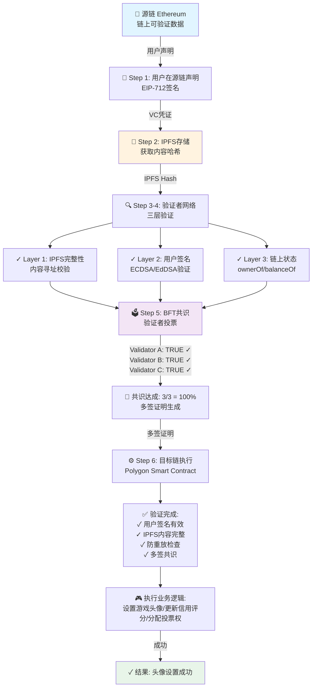

---

## 图2：系统架构与核心模块

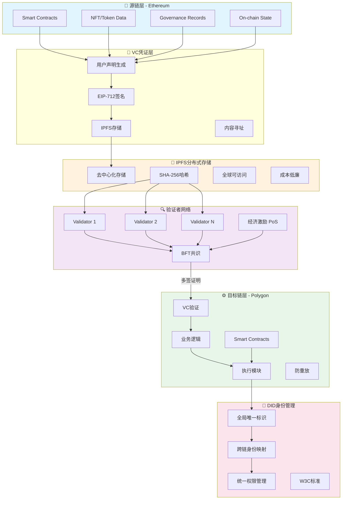

---

## 图3：VC凭证结构详解

```mermaid
graph LR
    subgraph VC["📄 Verifiable Credential Structure"]
        H["vcId<br/>nft:bayc:1234"] --> B["issuer DID<br/>did:eth:0x..."]
        B --> C["timestamp<br/>1704614400"]
        C --> D["sourceChain<br/>ethereum"]
        D --> E["targetChain<br/>polygon"]
        E --> F["claim<br/>I own NFT #1234"]
        F --> G["owner<br/>0xUserAddress"]
        G --> G1["nftContract<br/>0xBC4CA0E..."]
        G1 --> G2["tokenId<br/>1234"]
        G2 --> I["signature<br/>0xabc123..."]
        I --> J["signatureType<br/>EIP712"]
        J --> K["contentHash<br/>QmVC..."]
    end
    
    subgraph Storage["💾 存储流程"]
        U["用户私钥"]
        U --> G3["生成VC"]
        G3 --> S1["EIP-712签名"]
        S1 --> S2["提交到IPFS"]
        S2 --> S3["计算SHA-256"]
        S3 --> S4["获取IPFS Hash"]
        S4 --> S5["提交到目标链"]
    end
    
    style VC fill:#fff3e0,stroke:#ff6f00,stroke-width:2px
    style Storage fill:#e8f5e9,stroke:#2e7d32,stroke-width:2px
```

---

## 图4：三层验证机制

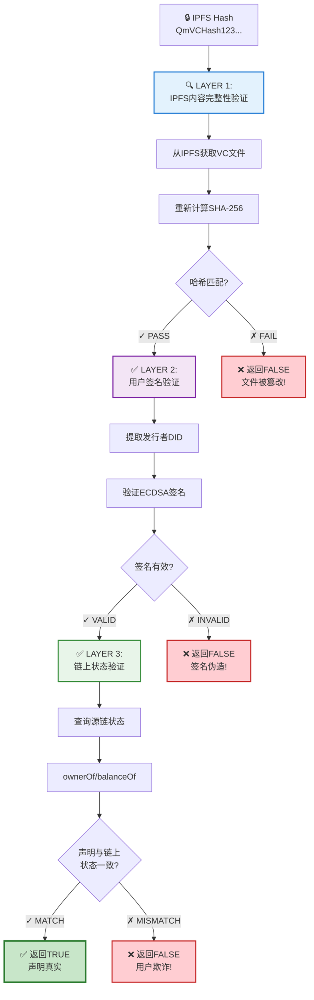

---

## 图5：灵活验证强度机制

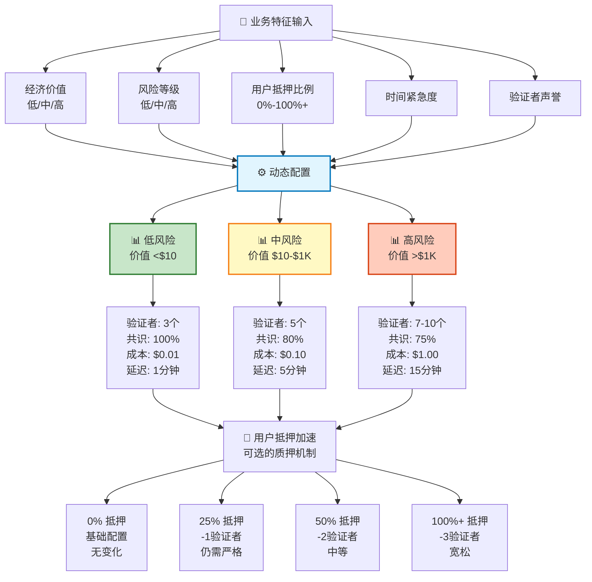

---

## 图6：防欺诈双重检测机制

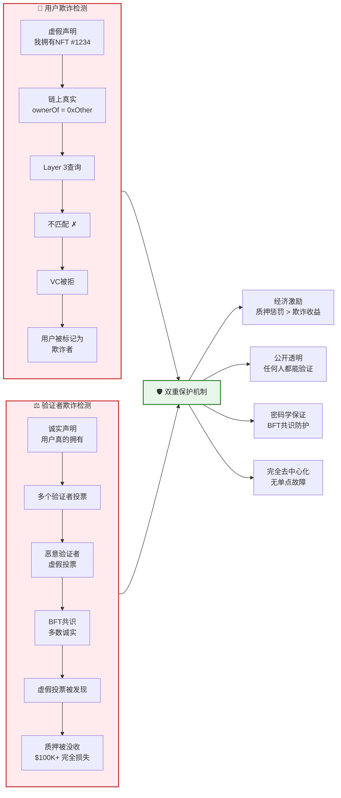

---

## 图7：三个典型应用场景

### 场景1：跨链NFT头像系统

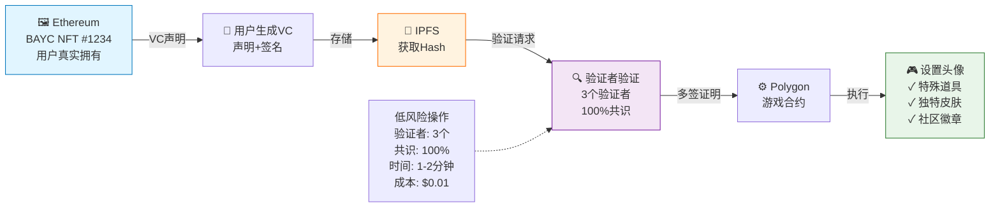

### 场景2：跨链信用评分

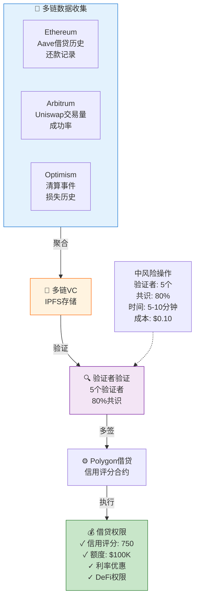

### 场景3：跨链DAO治理

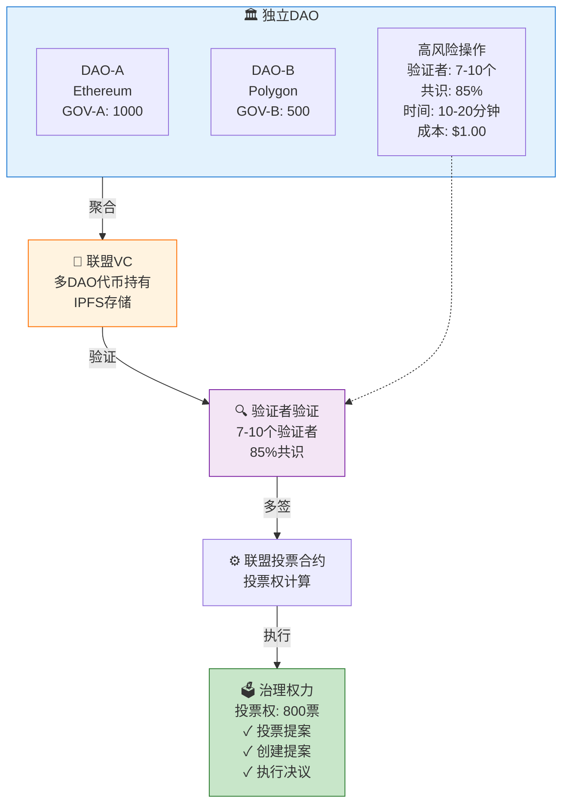

### 应用场景对比

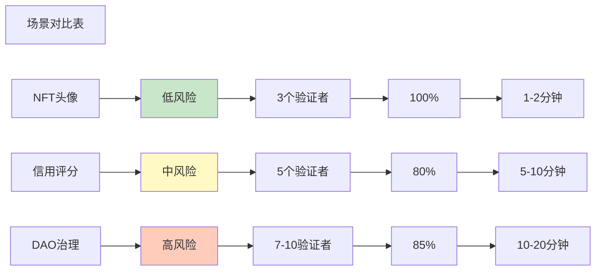

---

## 图8：与现有跨链方案的对比

### 对比维度1：技术方案选择

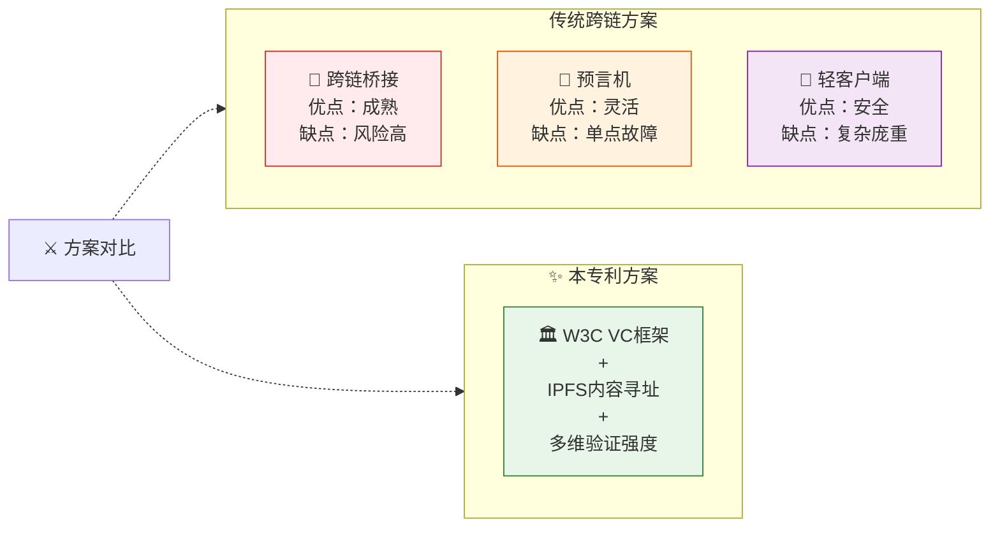

### 对比维度2：核心特性对比表

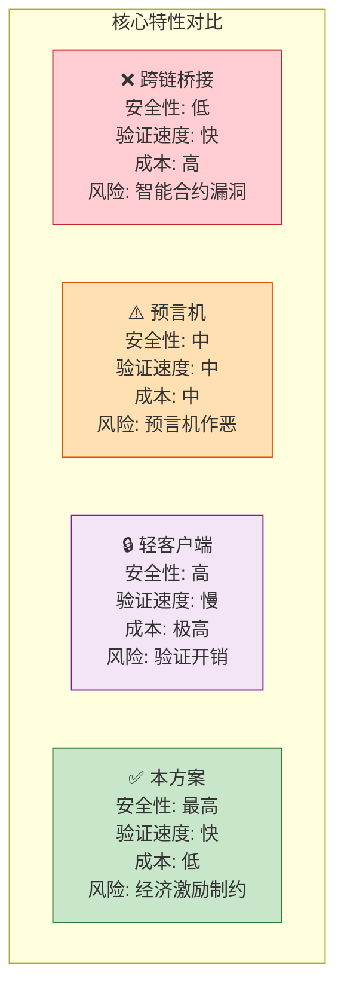

### 对比维度3：优势对标

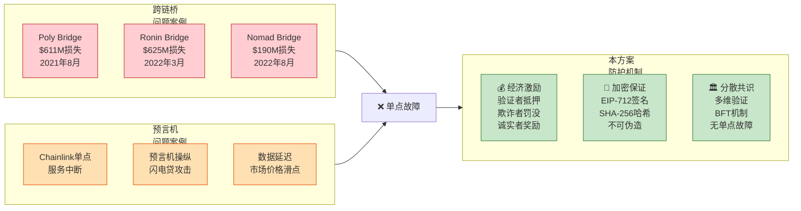

### 对比维度4：功能矩阵

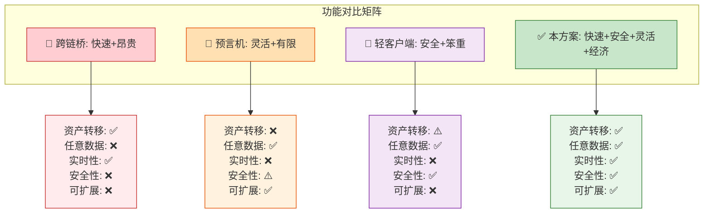

### 对比维度5：成本与安全权衡

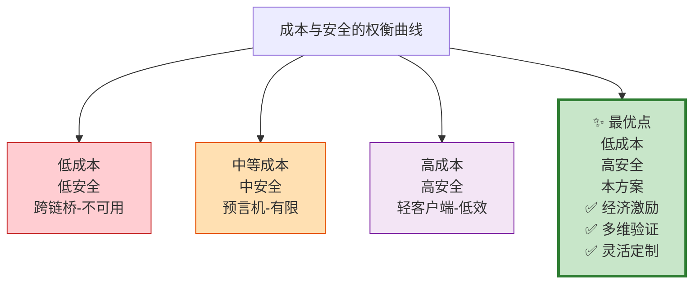

### 对比维度6：综合评分雷达图

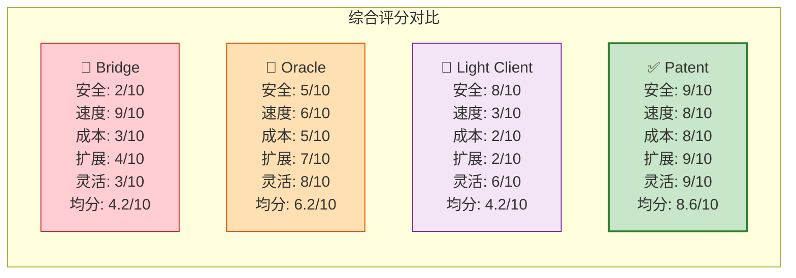

### 对比维度7：典型应用场景支持度

```mermaid
graph TB
    subgraph Scenarios["应用场景支持情况"]
        S1["跨链资产转移"]
        S2["数据交互验证"]
        S3["身份认证"]
        S4["信用评分"]
        S5["治理投票"]
        S6["权利证明"]
    end
    
    S1 -->|Bridge| B["✅"]
    S1 -->|Oracle| O["❌"]
    S1 -->|LC| LC["⚠️"]
    S1 -->|Patent| P["✅✅"]
    
    S2 -->|Bridge| B2["❌"]
    S2 -->|Oracle| O2["✅"]
    S2 -->|LC| LC2["✅"]
    S2 -->|Patent| P2["✅✅"]
    
    S3 -->|Bridge| B3["❌"]
    S3 -->|Oracle| O3["⚠️"]
    S3 -->|LC| LC3["✅"]
    S3 -->|Patent| P3["✅✅"]
    
    S4 -->|Bridge| B4["❌"]
    S4 -->|Oracle| O4["✅"]
    S4 -->|LC| LC4["⚠️"]
    S4 -->|Patent| P4["✅✅"]
    
    S5 -->|Bridge| B5["❌"]
    S5 -->|Oracle| O5["⚠️"]
    S5 -->|LC| LC5["✅"]
    S5 -->|Patent| P5["✅✅"]
    
    S6 -->|Bridge| B6["❌"]
    S6 -->|Oracle| O6["⚠️"]
    S6 -->|LC| LC6["✅"]
    S6 -->|Patent| P6["✅✅"]
    
    style B fill:#ffcdd2
    style O fill:#ffe0b2
    style LC fill:#f3e5f5
    style P fill:#c8e6c9,stroke:#2e7d32,stroke-width:2px
    style B2 fill:#ffcdd2
    style O2 fill:#c8e6c9
    style LC2 fill:#c8e6c9
    style P2 fill:#c8e6c9,stroke:#2e7d32,stroke-width:2px
    style B3 fill:#ffcdd2
    style O3 fill:#fff3e0
    style LC3 fill:#c8e6c9
    style P3 fill:#c8e6c9,stroke:#2e7d32,stroke-width:2px
    style B4 fill:#ffcdd2
    style O4 fill:#c8e6c9
    style LC4 fill:#fff3e0
    style P4 fill:#c8e6c9,stroke:#2e7d32,stroke-width:2px
    style B5 fill:#ffcdd2
    style O5 fill:#fff3e0
    style LC5 fill:#c8e6c9
    style P5 fill:#c8e6c9,stroke:#2e7d32,stroke-width:2px
    style B6 fill:#ffcdd2
    style O6 fill:#fff3e0
    style LC6 fill:#c8e6c9
    style P6 fill:#c8e6c9,stroke:#2e7d32,stroke-width:2px
```

---

## 总结：创新优势

本专利的**关键竞争优势**：

| 维度 | 优势 | 对标方案 |
|------|------|---------|
| **安全性** | 经济激励+密码学保证+分散共识 | 桥接风险、预言机单点、轻客户端验证成本 |
| **成本效率** | 基于验证强度的灵活配置 | 固定成本（桥接高、轻客户端极高） |
| **扩展性** | 多链、多维、可定制 | 桥接黑盒、预言机有限、轻客户端不可扩展 |
| **通用性** | 任意状态、任意业务逻辑 | 桥接限于资产、预言机限于数据、轻客户端复杂 |
| **可靠性** | BFT共识、无单点故障 | 单点故障风险（已有多个亿级损失案例） |

---

**Document Generated**: January 13, 2026
**Purpose**: Visual reference for patent application on decentralized cross-chain fact transmission
**Format**: Markdown with ASCII diagrams for tool-independent visualization
