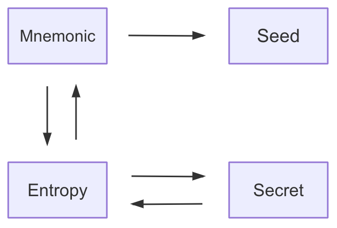

# 如何使用

HDWallet类

## 构造函数

```ts
/**
 * generate hd wallet
 *
 * @param {any} opt options of generate, like:
 *                  {
 *                    mnemonic: "world list", // optional
 *                    // see also:bip39 https://github.com/bitcoinjs/bip39/tree/master/ts_src/wordlists
 *                    // language attribute appears with mnemonic attribute
 *                    language: english default/chinese_simplified/...
 *                    secret: "secret string", // optional, default this coding rules of SWTC chain
 *                    keypair: {privateKey: "xxxx", publicKey: "xxxx"}
 *                  }
 *                  way of create hd wallet
 *                  1. {mnemonic: "xxx", language:"english"}
 *                  2. {secret: "xxxx"}
 *                  3. {keypair: {....}, path:{....}}
 * @returns {object} return hd wallet object
 */
constructor(opt: any)
```
本节测试用例：

助记词：soccer want seat goddess phone awake peasant high correct robot believe door

密钥：snZeokZMVSEynpKCt7Zvk5pkFZAHt

## 生成助记词

```ts
/**
 * generate mnemonic
 *
 * @static
 * @param {number} len strength of random bytes, default 128
 * @param {string} language localized word list, default is english. see also https://github.com/bitcoinjs/BIP39
 * @returns {string} return mnemonic string, spilt by blank
 */
public static function generateMnemonic(len: number = 128, language: string = "english"): string
```

:::details {{$frontmatter.checkCode}}
<pre class="code no_drop" id="code_generateMnemonic">
const { HDWallet} = require('jcc_wallet').hdWallet

const mnemonic = HDWallet.generateMnemonic()

console.log(mnemonic)
</pre>

<runCode tid="code_generateMnemonic" />
:::

## 从助记词得到密钥



```ts
/**
 * get secret from mnemonic, obey encode rule base58 for jingtum
 *
 * @static
 * @param {string} mnemonic mnemonic words
 * @param {string} language localized word list, default is english. see also https://github.com/bitcoinjs/BIP39
 * @returns {string} return secret string
 */
public static function getSecretFromMnemonic(mnemonic: string, language: string = "english"): string

```

:::details {{$frontmatter.checkCode}}
<pre class="code no_drop" id="code_getSecretFromMnemonic">
const { HDWallet} = require('jcc_wallet').hdWallet

const testMnemonic = "soccer want seat goddess phone awake peasant high correct robot believe door"
const testSecret = HDWallet.getSecretFromMnemonic(testMnemonic)

console.log(testSecret)
</pre>

<runCode tid="code_getSecretFromMnemonic" />
:::

## 从密钥得到助记词

```ts
/**
 * get mnemonic from secret, obey encode rule base58 for jingtum
 *
 * @static
 * @param {string} secret secret string
 * @param {string} language localized word list, default is english. see also https://github.com/bitcoinjs/BIP39
 * @returns {string} return mnemonic word list
 */
public static function getMnemonicFromSecret(secret: string, language: string = "english"): string 
```

:::details {{$frontmatter.checkCode}}
<pre class="code no_drop" id="code_getMnemonicFromSecret">
const { HDWallet} = require('jcc_wallet').hdWallet

const testSecret = "snZeokZMVSEynpKCt7Zvk5pkFZAHt"
const testMnemonic = HDWallet.getMnemonicFromSecret(testSecret)

console.log(testMnemonic)
</pre>

<runCode tid="code_getMnemonicFromSecret" />
:::

## 密钥派生出密钥对

```ts
/**
 * get keypair from secret
 *
 * @static
 * @param {string} secret secret string
 * @returns {object} return keypair object
 */
public static function getKeypairFromSecret(secret: string): any
```

:::details {{$frontmatter.checkCode}}
<pre class="code no_drop" id="code_getKeypairFromSecret">
const { HDWallet} = require('jcc_wallet').hdWallet

const testSecret = "snZeokZMVSEynpKCt7Zvk5pkFZAHt"
const keyPair = HDWallet.getKeypairFromSecret(testSecret)

console.log('私钥：'+keyPair.privateKey)
console.log('公钥：'+keyPair.publicKey)
</pre>

<runCode tid="code_getKeypairFromSecret" />
:::

## 派生HD密钥对

```ts
/**
 * get hd wallet key pair
 *
 * @static
 * @param {string} rootSecret root secret
 * @param {number} chain chain index number
 * @param {number} account bip44 account index for purpose
 * @param {number} index bip44 last level index
 * @returns {IKeyPair} return keypair object
 */
public static function getHDKeypair(rootSecret: string, chain: number, account: number = 0, index: number): IKeyPair
```

:::details {{$frontmatter.checkCode}}
<pre class="code no_drop" id="code_getHDKeypair">
const { HDWallet} = require('jcc_wallet').hdWallet

const rootSecret = "snZeokZMVSEynpKCt7Zvk5pkFZAHt"
const chain = 0x8000003c  //ETH
const account = 0
const index = 0
const keyPair = HDWallet.getHDKeypair(rootSecret, chain, account, index)

console.log('私钥：'+keyPair.privateKey)
console.log('公钥：'+keyPair.publicKey)
</pre>

<runCode tid="code_getHDKeypair" />
:::

## 创建HD钱包对象实例

```ts
/**
 * generate hd wallet
 *
 * @static
 * @param {any} opt options of generate, like:
 *                  {
 *                    len: 128/160/192/224/256, default is 128, determines number of mnemonic word
 *                    language: english default/chinese_simplified/chinese_traditional/czech/korean/french/japanese/... see also:bip39 https://github.com/bitcoinjs/bip39/tree/master/ts_src/wordlists
 *                  }
 * @returns {object} return hd wallet object
 */
public static function generate(opt: any): HDWallet
```

:::details {{$frontmatter.checkCode}}
<pre class="code no_drop" id="code_generate">
const { HDWallet} = require('jcc_wallet').hdWallet

const hdWallet = HDWallet.generate() //default

console.log(hdWallet)
</pre>

<runCode tid="code_generate" />
:::

## 通过根密钥创建HD钱包对象实例

```ts
/**
 * create hd wallet from secret
 *
 * @static
 * @param {string} secret secret string
 * @returns {object} return hd wallet object
 */
public static function fromSecret(secret: string): HDWallet
```

:::details {{$frontmatter.checkCode}}
<pre class="code no_drop" id="code_fromSecret">
const { HDWallet} = require('jcc_wallet').hdWallet

const testSecret = 'snZeokZMVSEynpKCt7Zvk5pkFZAHt'
const hdWallet = HDWallet.fromSecret(testSecret)

console.log(hdWallet)
</pre>

<runCode tid="code_fromSecret" />
:::

## 通过助记词创建HD钱包对象实例

```ts
/**
 * create hd wallet from mnemonic
 *
 * @static
 * @param {IMnemonic} mnemonic object like
 *                    {mnemonic: "abc abc ...", language: "english"}
 * @returns {object} return hd wallet object
 */
public static function fromMnemonic(mnemonic: IMnemonic): HDWallet
```

:::details {{$frontmatter.checkCode}}
<pre class="code no_drop" id="code_fromMnemonic">
const { HDWallet} = require('jcc_wallet').hdWallet

const mnemonic = {
  mnemonic: 'soccer want seat goddess phone awake peasant high correct robot believe door',
  language: 'english'
}
const hdWallet = HDWallet.fromMnemonic(mnemonic)

console.log(hdWallet)
</pre>

<runCode tid="code_fromMnemonic" />
:::

## 通过密钥对创建HD钱包对象实例

一般只在签名时才会使用这种实例化方式
```ts
 /**
 * create hd wallet from keypair,wallet create by keypair, which only for sign message and tx
 *
 * @static
 * @param {IKeyPair} keypair object like
 *                    {publicKey: "public key...", privateKey: "private key..."}
 * @returns {object} return hd wallet object
 */
public static function fromKeypair(keypair: IKeyPair): HDWallet
```

:::details {{$frontmatter.checkCode}}
<pre class="code no_drop" id="code_fromKeypair">
const { HDWallet} = require('jcc_wallet').hdWallet

const keypair = {
  privateKey: '004AB9C9788B717CC3BBFD04879CB91F15278B1D6553192D4B58FAE6C69160196F',
  publickKey: '03CB56B9DE889AE9FFC105CD3FF44B473F81EFE304F03088F5FE717A87E5FEF162'
}
const hdWallet = HDWallet.fromKeypair(keypair)

console.log(hdWallet)
</pre>

<runCode tid="code_fromKeypair" />
:::

## HDWallet实例

### 判断HD钱包是否是root

```ts
/**
 * hd wallet is root or not
 *
 * @returns {boolean} return hd wallet root or not
 */
public isRoot = (): boolean
```

:::details {{$frontmatter.checkCode}}
<pre class="code no_drop" id="code_isRoot">
const { HDWallet, BIP44Chain } = require('jcc_wallet').hdWallet

const mnemonic = {
  mnemonic: 'soccer want seat goddess phone awake peasant high correct robot believe door',
  language: 'english'
}
const hdWallet = HDWallet.fromMnemonic(mnemonic)

console.log(hdWallet.isRoot())
</pre>

<runCode tid="code_isRoot" />
:::

### 派生钱包

```ts
/**
 * generate hd wallet by derive path, obey BIP44 protocol
 *
 * @param {any} opt options of derive, like:
 *                  {
 *                    chain: BIP44Chain.ETH, //chain code defined in bip44
 *                    account: 0, // account for what purpose
 *                    change: 0, // optional attrube,default always 0, for change account after transfer
 *                    index: 0, // accout index
 *                  }
 * @returns {object} return hd wallet object
 */
public function deriveWallet(opt: any): HDWallet
```

:::details {{$frontmatter.checkCode}}
<pre class="code no_drop" id="code_deriveWallet">
const { HDWallet, BIP44Chain } = require('jcc_wallet').hdWallet

const mnemonic = {
  mnemonic: 'soccer want seat goddess phone awake peasant high correct robot believe door',
  language: 'english'
}
const hdWallet = HDWallet.fromMnemonic(mnemonic)
const newHDWallet = hdWallet.deriveWallet({
  chain: BIP44Chain.ETH,
  account: 0,
  index: 0
})

console.log(newHDWallet)
console.log(newHDWallet.isRoot())
</pre>

<runCode tid="code_deriveWallet" />
:::

### 对内容进行hash

```ts
/**
 * hash message
 *
 * @param {string} message
 * @returns {string} return hash of message
 */
public function hash(message: string): string
```

:::details {{$frontmatter.checkCode}}
<pre class="code no_drop" id="code_hash">
const { HDWallet } = require('jcc_wallet').hdWallet

const testSecret = 'snZeokZMVSEynpKCt7Zvk5pkFZAHt'
const hdWallet = HDWallet.fromSecret(testSecret)
const hash = hdWallet.hash('jcc_wallet_hdwallet')

console.log(hash)
</pre>

<runCode tid="code_hash" />
:::

### 对内容进行签名

```ts
/**
 * sign message
 * @notice how to operate message(raw or hashed) is different in native sdk of different chain
 *         to avoid confusion, we assume that native sdk will automatically hashed message
 *         if not the case of native sdk, we hash this message in lower level(plugin), for example ethereum sdk
 * @param {string} message
 * @returns {string} return signature string
 */
public function sign(message: string): string
```

:::details {{$frontmatter.checkCode}}
<pre class="code no_drop" id="code_sign">
const { HDWallet } = require('jcc_wallet').hdWallet

const testSecret = 'snZeokZMVSEynpKCt7Zvk5pkFZAHt'
const hdWallet = HDWallet.fromSecret(testSecret)
const signature = hdWallet.sign('jcc_wallet_hdwallet')

console.log(signature)
</pre>

<runCode tid="code_sign" />
:::

### 校验签名是否有效

```ts
/**
 * verify signature valid or not
 *
 * @param {string} message origin message
 * @param {string} signature signature
 * @param {string} address account which sign
 * @param {IKeyPair} keypair keypair object, usually to provide public key, private key not required
 *
 * @returns {boolean} true valid, false invalid
 */
public function verify(messgae: string, signature: string, address?: string, keypair?: IKeyPair): boolean
```

:::details {{$frontmatter.checkCode}}
<pre class="code no_drop" id="code_verify">
const { HDWallet } = require('jcc_wallet').hdWallet

const testSecret = 'snZeokZMVSEynpKCt7Zvk5pkFZAHt'
const hdWallet = HDWallet.fromSecret(testSecret)
const signature = hdWallet.sign('jcc_wallet_hdwallet')

const testResult1 = hdWallet.verify('jcc_wallet_hdwallet', signature)
const testResult2 = hdWallet.verify('jcc_wallet_hd_wallet', signature)

console.log(testResult1)
console.log(testResult2)
</pre>

<runCode tid="code_verify" />
:::

### 通过签名信息恢复地址/账户

**注：该方法不支持swtc链**

```ts
/**
 * recover address/account from signature
 *
 * @param {string} message origin message
 * @param {string} signature signature
 *
 * @returns {string} return address
 */
public function recover(messgae: string, signature: string): string
```

:::details {{$frontmatter.checkCode}}
<pre class="code no_drop" id="code_recover">
const { HDWallet, BIP44Chain } = require('jcc_wallet').hdWallet

const mnemonic = {
  mnemonic: 'soccer want seat goddess phone awake peasant high correct robot believe door',
  language: 'english'
}
const hdWallet = HDWallet.fromMnemonic(mnemonic)
const newHDWallet = hdWallet.deriveWallet({
  chain: BIP44Chain.ETH,
  account: 0,
  index: 0
})

const message = 'jcc_wallet_hdwallet'
const signature = newHDWallet.sign(message)
const testResult = newHDWallet.recover(message, signature)

console.log('Address: '+newHDWallet.address())
console.log('recoverAddress: '+testResult)
</pre>

<runCode tid="code_recover" />
:::

### 获取链API

```ts
/**
 * get specified chain wallet api
 *
 * @returns {IHDPlugin} return hd plugin object
 */
public function getWalletApi(): IHDPlugin
```

:::details {{$frontmatter.checkCode}}
<pre class="code no_drop" id="code_getWalletApi">
const { HDWallet } = require('jcc_wallet').hdWallet

const testSecret = 'snZeokZMVSEynpKCt7Zvk5pkFZAHt'
const hdWallet = HDWallet.fromSecret(testSecret)
const walletApi = hdWallet.getWalletApi()

console.log(walletApi) //结果请打开控制台查看
</pre>

<runCode tid="code_getWalletApi" />
:::

### 返回钱包密钥

```ts
/**
 * get wallet secret
 *
 * @returns {string} return wallet secret
 */
public function secret(): string
```

:::details {{$frontmatter.checkCode}}
<pre class="code no_drop" id="code_secret">
const { HDWallet } = require('jcc_wallet').hdWallet

const mnemonic = {
  mnemonic: 'soccer want seat goddess phone awake peasant high correct robot believe door',
  language: 'english'
}
const hdWallet = HDWallet.fromMnemonic(mnemonic)
const secret = hdWallet.secret()
console.log(secret)
</pre>

<runCode tid="code_secret" />
:::

### 返回钱包助记词

```ts
/**
 * get wallet mnemonic
 *
 * @returns {IMnemonic} return IMnemonic object
 */
public function mnemonic(): IMnemonic
```

:::details {{$frontmatter.checkCode}}
<pre class="code no_drop" id="code_mnemonic">
const { HDWallet } = require('jcc_wallet').hdWallet

const testSecret = 'snZeokZMVSEynpKCt7Zvk5pkFZAHt'
const hdWallet = HDWallet.fromSecret(testSecret)
const mnemonic = hdWallet.mnemonic()

console.log(mnemonic.mnemonic)
</pre>

<runCode tid="code_mnemonic" />
:::

### 返回钱包所在链

```ts
/**
 * get chain of hd wallet
 *
 * @returns {string} return chain of hd wallet
 */
public function chain(): string
```

:::details {{$frontmatter.checkCode}}
<pre class="code no_drop" id="code_chain">
const { HDWallet, BIP44Chain } = require('jcc_wallet').hdWallet

const testSecret = 'snZeokZMVSEynpKCt7Zvk5pkFZAHt'

const hdWallet = HDWallet.fromSecret(testSecret)
const newHDWallet = hdWallet.deriveWallet({
  chain: BIP44Chain.ETH,
  account: 0,
  index: 0
})

const chain1 = hdWallet.chain()
const chain2 = newHDWallet.chain()

console.log(chain1)
console.log(chain2)
</pre>

<runCode tid="code_chain" />
:::

### 返回钱包地址

```ts
/**
 * get address of hd wallet
 *
 * @returns {string} return address of hd wallet
 */
public function address(): string
```

:::details {{$frontmatter.checkCode}}
<pre class="code no_drop" id="code_address">
const { HDWallet } = require('jcc_wallet').hdWallet

const testSecret = 'snZeokZMVSEynpKCt7Zvk5pkFZAHt'
const hdWallet = HDWallet.fromSecret(testSecret)
const address = hdWallet.address()

console.log(address)
</pre>

<runCode tid="code_address" />
:::

### 返回钱包密钥对

```ts
/**
 * get keypair of hd wallet
 *
 * @returns {IKeyPair} return keypair of message
 */
public function keypair(): IKeyPair
```

:::details {{$frontmatter.checkCode}}
<pre class="code no_drop" id="code_keypair">
const { HDWallet } = require('jcc_wallet').hdWallet

const testSecret = 'snZeokZMVSEynpKCt7Zvk5pkFZAHt'
const hdWallet = HDWallet.fromSecret(testSecret)
const keyPair = hdWallet.keypair()

console.log('私钥：'+keyPair.privateKey)
console.log('公钥：'+keyPair.publicKey)
</pre>

<runCode tid="code_keypair" />
:::

### 返回钱包路径

```ts
/**
 * get path of hd wallet
 *
 * @returns {IBIP44Path} return path of wallet
 */
public function path(): IBIP44Path
```

:::details {{$frontmatter.checkCode}}
<pre class="code no_drop" id="code_path">
const { HDWallet, BIP44Chain } = require('jcc_wallet').hdWallet

const mnemonic = {
  mnemonic: 'soccer want seat goddess phone awake peasant high correct robot believe door',
  language: 'english'
}
const hdWallet = HDWallet.fromMnemonic(mnemonic)
const newHDWallet = hdWallet.deriveWallet({
  chain: BIP44Chain.ETH,
  account: 0,
  index: 1
})

const path1 = hdWallet.path()
const path2 = newHDWallet.path()

console.log(path1)
console.log(path2)
</pre>

<runCode tid="code_path" />
:::

### 设置密钥对

```ts
/**
 * set keypair
 * @param {IKeyPair} keypair
 */
public function setKeypair(keypair: IKeyPair): void
```

### 校验地址是否有效

```ts
/**
 * check address valid or not
 * @param {string} address
 * @returns {boolean} true valid, false invalid
 */
public function isValidAddress(address: string): boolean
```

### 校验密钥是中否有效

```ts
/**
 * check secret valid or not
 *
 * @param {string} secret
 * @returns {boolean} true valid, false invalid
 */
public function isValidSecret(address: string): boolean
```
